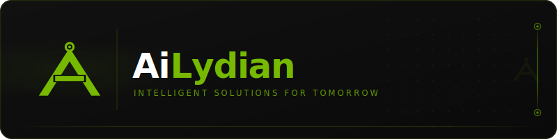
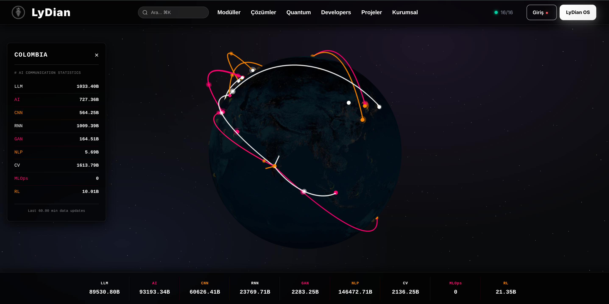
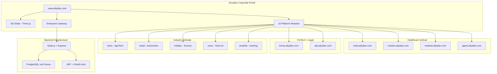

<div align="center">
  
  <br><br>

# AiLydian

### Enterprise Technology Ecosystem Portal with 15+ Specialized Platforms and 3D Global Visualization
### Kurumsal Teknoloji Ekosistem Portali - 15+ Uzman Platform ve 3D Kuresel Gorsellestirme

[](https://www.ailydian.com)
[]()
[]()

</div>

---

## Preview

<div align="center">
  
  <br><em>Interactive 3D Globe - Real-time global intelligence visualization with LLM, AE, CNN, RNN, GAR, NLP, CV, and RL metrics across all platforms</em>
</div>

---

## Executive Summary

AiLydian (www.ailydian.com) is the central corporate portal and technology ecosystem hub for a portfolio of 15+ specialized platforms spanning healthcare, fintech, legal tech, agriculture, gaming, tourism, automotive, government, and voice technology. The platform features an interactive Three.js-powered 3D globe visualization displaying real-time global intelligence statistics across LLM, AE, CNN, RNN, GAR, NLP, CV, and RL metrics, serving as the unified gateway to the entire AiLydian ecosystem.

The corporate website serves three strategic functions: (1) primary brand presence and investor relations hub with immersive 3D visualization, (2) centralized navigation gateway to all 15+ sub-platforms, and (3) enterprise partnership and consulting engagement engine. Built on Node.js/Express with PostgreSQL via Prisma, the platform implements enterprise-grade security with custom JWT + OAuth authentication, OWASP Top 10 hardening, and comprehensive CSP headers.

AiLydian's revenue model centers on enterprise consulting engagements, strategic partnership referrals across the ecosystem, and corporate platform licensing -- creating a high-margin, relationship-driven revenue stream.

## Yonetici Ozeti

AiLydian (www.ailydian.com), saglik, fintech, hukuk teknolojisi, tarim, oyun, turizm, otomotiv, devlet ve ses teknolojisi alanlarinda 15+ uzmanlasmis platformdan olusan bir portfoye yonelik merkezi kurumsal portal ve teknoloji ekosistemi merkezidir. Platform, LLM, AE, CNN, RNN, GAR, NLP, CV ve RL metrikleri uzerinden gercek zamanli kuresel zeka istatistiklerini gosteren Three.js destekli interaktif 3D kure gorsellestirmesi ile tum AiLydian ekosistemine birlesik giris noktasi olarak hizmet etmektedir.

Kurumsal web sitesi uc stratejik isleve hizmet eder: (1) etkileyici 3D gorsellestirme ile birincil marka varligi ve yatirimci iliskileri merkezi, (2) 15+ alt platforma merkezi navigasyon gecidi ve (3) kurumsal ortaklik ve danismanlik angazman motoru.

---

## Key Metrics

| Metric | Value |
|--------|-------|
| Platform Portfolio | 15+ specialized sub-platforms |
| Module Count | 16 integrated modules |
| 3D Visualization | Three.js real-time globe |
| Product Categories | 9 industry verticals |
| Authentication | Custom JWT + OAuth |
| Security | OWASP Top 10 hardened |

---

## Revenue Model & Projections

### Business Model

AiLydian generates revenue through three channels: **Enterprise consulting** ($5K-50K per engagement), **partnership referral fees** (10-15% of sub-platform contract value), and **corporate platform licensing** for white-label deployments.

### 5-Year Revenue Forecast

| Year | Enterprise Clients | ARR | Growth |
|------|-------------------|-----|--------|
| Y1 | 10 | $50K | -- |
| Y2 | 40 | $200K | 300% |
| Y3 | 80 | $500K | 150% |
| Y4 | 120 | $1M | 100% |
| Y5 | 200 | $2M | 100% |

---

## Market Opportunity

| Segment | Size |
|---------|------|
| **TAM** (Global Enterprise Software Ecosystem Market) | $800B+ by 2030 |
| **SAM** (Turkish Enterprise Tech + MENA Expansion) | $15B |
| **SOM** (Multi-vertical tech ecosystem portals) | $200M |

**Key Differentiators:** Only multi-vertical technology ecosystem with 15+ production platforms under a single corporate umbrella. Real-time 3D intelligence visualization. Full-stack vertical integration from healthcare to gaming.

---

## Tech Stack

<div align="center">


| Layer | Technology |
|-------|-----------|
| Backend | Node.js + Express |
| Database | PostgreSQL via Prisma ORM |
| 3D Visualization | Three.js (interactive globe) |
| Frontend | HTML5, CSS3, JavaScript |
| Authentication | Custom JWT + OAuth |
| Deployment | Vercel / Custom Server |
| Security | CSP, CORS, Rate Limiting, OWASP Top 10 |
| SEO | Structured Data, Sitemap, Multi-Language |

</div>

---

## Competitive Advantages

- **Unparalleled Breadth** -- 15+ production platforms across 9 industry verticals under one ecosystem
- **3D Intelligence Visualization** -- Real-time Three.js globe with live global statistics (LLM, AE, CNN, RNN, GAR, NLP, CV, RL metrics)
- **Vertical Integration** -- Full-stack from healthcare to fintech to gaming creates cross-selling synergies
- **Turkish Market First-Mover** -- Deepest technology ecosystem targeting the $900B Turkish economy

---

## Architecture



---

## Platform Directory

| Platform | Domain | Vertical |
|----------|--------|----------|
| Medi | medi.ailydian.com | Hospital SaaS |
| Median | median.ailydian.com | Blockchain Health Records |
| Medical | medical.ailydian.com | Clinical Dashboard |
| Agent | agent.ailydian.com | Multi-Agent Healthcare |
| Borsa | borsa.ailydian.com | Crypto Trading |
| Atty | atty.ailydian.com | Legal Intelligence |
| Tarim | tarim.ailydian.com | Agricultural Intelligence |
| OtoAil | otoail.ailydian.com | Automotive Intelligence |
| Holiday | holiday.ailydian.com | Tourism Platform |
| Voice | voice.ailydian.com | Voice Assistant PWA |
| Anatolia | anatolia.ailydian.com | MMO Gaming |
| Mimar | mimar.ailydian.com | Architecture Design |
| ADE | ade.ailydian.com | Smart Government |

---

## Getting Started

```bash
# Clone the repository
git clone https://github.com/lydianai/www.ailydian.com.git
cd www.ailydian.com

# Install dependencies
npm install

# Configure environment
cp .env.example .env
# Set DATABASE_URL, JWT_SECRET, SESSION_SECRET

# Start server
node server.js
# or
npm run dev
```

---

## Security & Compliance

| Standard | Implementation |
|----------|---------------|
| OWASP Top 10 | Full mitigation applied |
| CSP Headers | Strict Content Security Policy |
| Authentication | Custom JWT + OAuth with MFA support |
| Transport | HTTPS/TLS 1.3 enforced |
| Rate Limiting | Per-IP and per-user throttling |
| KVKK/GDPR | Personal data protection compliant |

---

## Contact

| | |
|---|---|
| **Email** | info@ailydian.com |
| **Email** | ailydian@ailydian.com |
| **Web** | [https://ailydian.com](https://ailydian.com) |
| **Corporate Portal** | [https://www.ailydian.com](https://www.ailydian.com) |

---

## License

Copyright (c) 2025-2026 AiLydian. All Rights Reserved.

This software is proprietary and confidential. Unauthorized copying, distribution, or modification is strictly prohibited.
